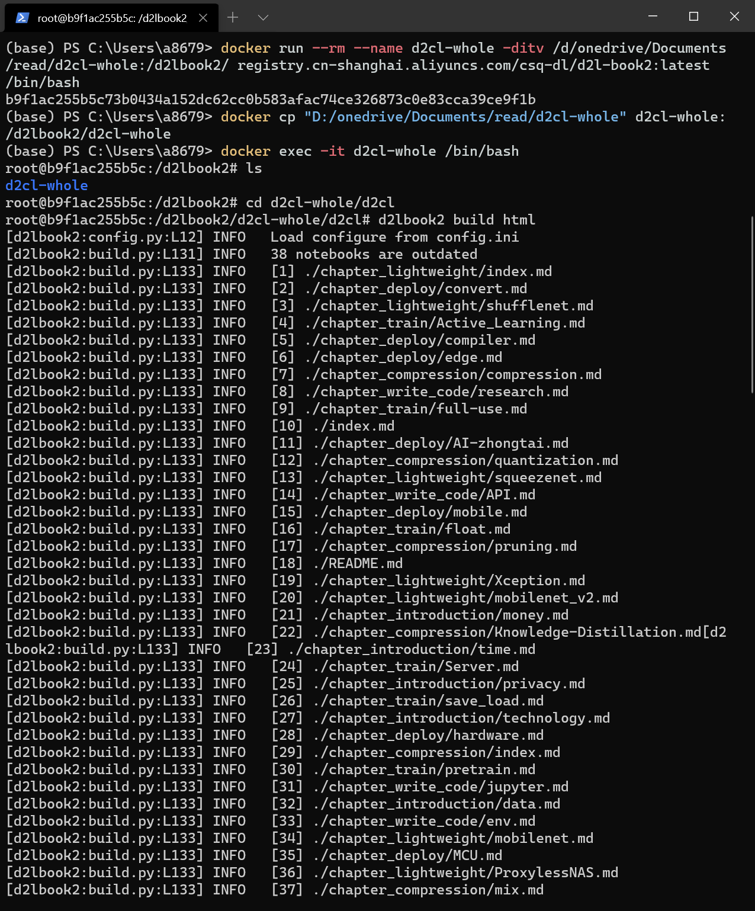
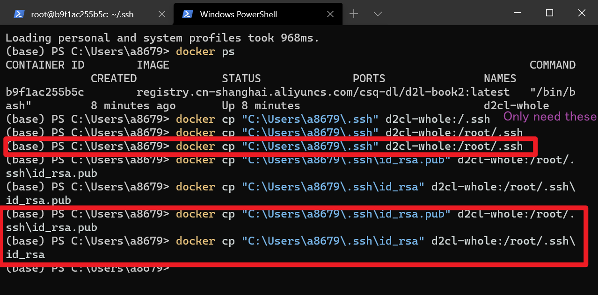
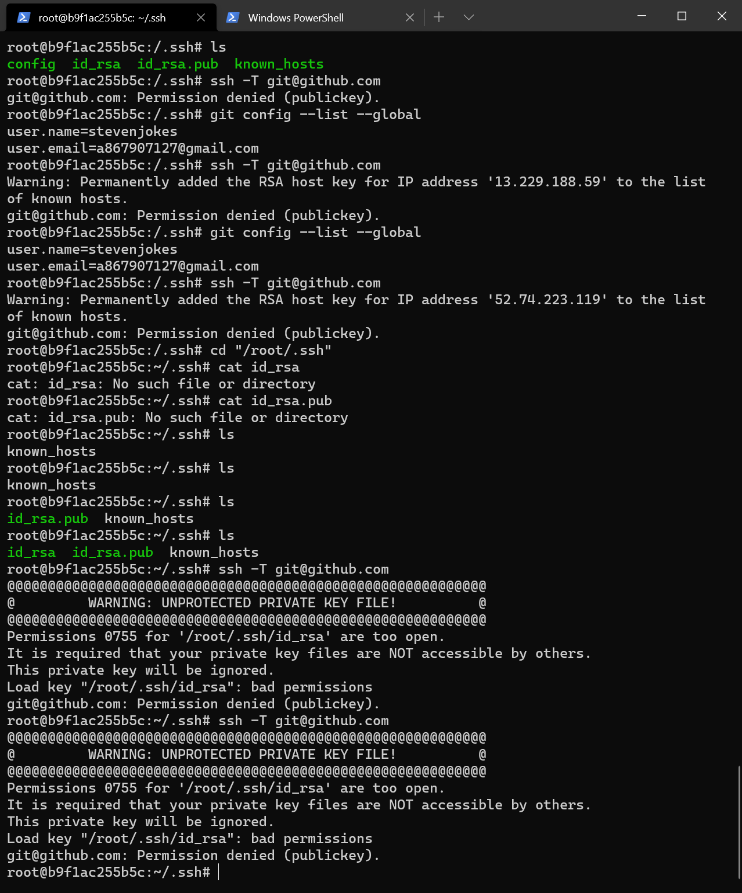
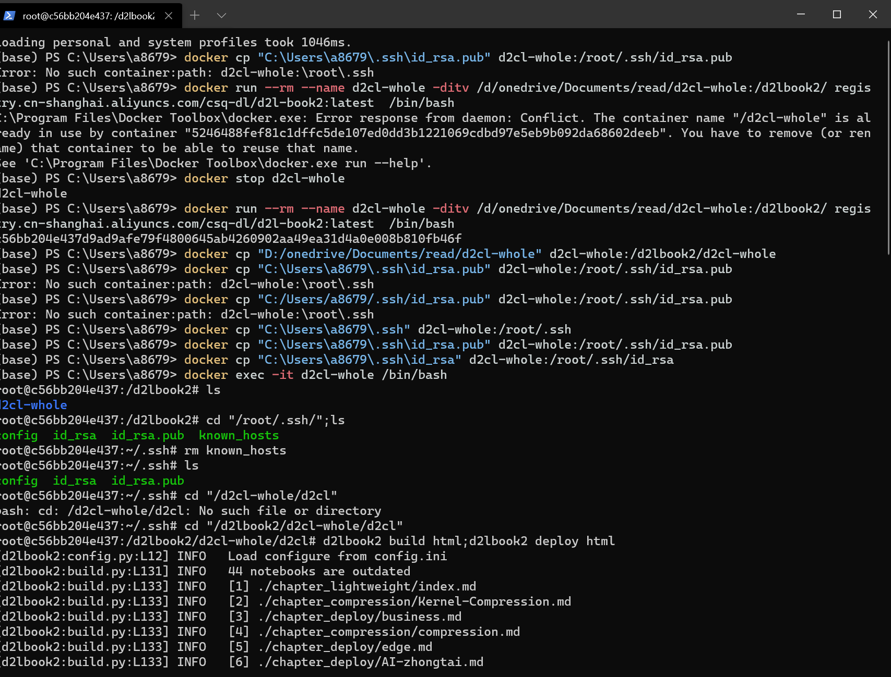
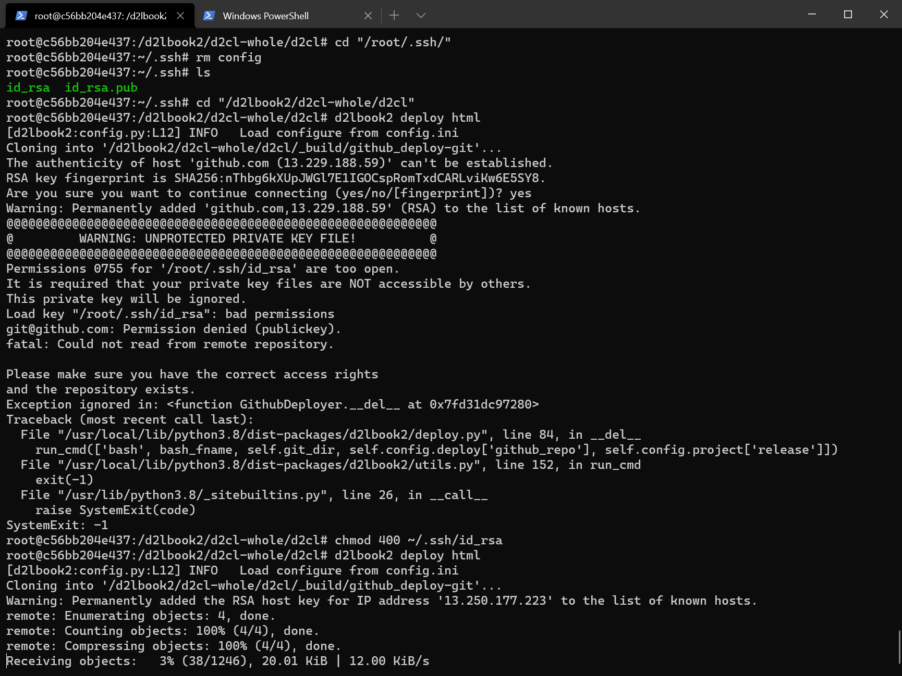

# D2L-Book2: A Toolkit for Hands-on Books

This package helps you build and publish **a book with Python code**, or
**Python package documents with tutorials**.

The difference is

* the document is available at docs/
* you can upload by any systems with docker.
* the docker is automatedly upload by gitflows.(now # push)

TODO: https://github.com/d2l-ai/d2l-book/commit/5f078f8812bb0f2bf45d9648fa80e1ba63f7b524
https://github.com/d2l-ai/d2l-book/commit/5f078f8812bb0f2bf45d9648fa80e1ba63f7b524


## Install:

```bash
pip install git+https://github.com/aieye-top/d2l-book2/
```

https://book.d2l.ai/user/deploy.html


## To deploy to Github

The only difference is

```bash
d2lbook2 deploy html
```

instead of `d2lbook deploy html`

 For this example, the URL is https://github.com/aieye-top/d2cl

The result:
https://aieye-top.github.io/d2cl/

## Docker

 https://github.com/ykxVK8yL5L/6pan/blob/main/.github/workflows/docker-image.yml
 https://www.youtube.com/watch?v=fSKbUgRL3vA

### Not China:

```bash
docker pull stevenjokes/d2l-book2:latest
```

```bash
docker run stevenjokes/d2l-book2:latest build html
```

---

### 国内：

```bash
docker pull registry.cn-shanghai.aliyuncs.com/csq-dl/d2l-book2:latest
```

![pull]](img/docker_pull.png)


#### 用例：

(base) PS C:\Users\a8679> docker run registry.cn-shanghai.aliyuncs.com/csq-dl/d2l-book2:latest
usage: d2lbook2 [-h] {build,deploy,clear,activate,translate}

D2L Book: Publish a book based on Jupyter notebooks. Run d2lbook2 command -h
to get the help message for each command.

positional arguments:
  {build,deploy,clear,activate,translate}

optional arguments:
  -h, --help            show this help message and exit


```bash
docker run --rm --name d2cl-whole -ditv /d/onedrive/Documents/read/d2cl-whole:/d2lbook2/d2cl-whole registry.cn-shanghai.aliyuncs.com/csq-dl/d2l-book2:latest  /bin/bash
```

* --rm: 在容器终止运行后自动删除容器文件
* --name: 给他指定了一个d2cl-whole名
* -d: 后台运行容器，并返回容器ID；
* -i: 以交互模式运行容器，通常与 -t 同时使用；
* -t: 为容器重新分配一个伪输入终端，通常与 -i 同时使用；
* -v: 把Win10宿主机的/d/onedrive/Documents/read/d2cl-whole/下载目录挂载到registry.cn-shanghai.aliyuncs.com/csq-dl/d2l-book2:latest容器的/d2lbook2目录下。


```bash
docker exec -it d2cl-whole /bin/bash
```


后来用了for win，就解决了

```bash
ls
```

应该能看到d2cl-whole

```bash
cd "/d2lbook2/d2cl-whole/d2cl"
d2lbook2 build html;d2lbook2 deploy html
```



### deploy to github

此时还没连上GitHub
不信可以
ssh -T git@github.com

在deploy之前给ssh

在容器里：

```bash
mkdir "/root/.ssh/"
```

```bash
docker cp "C:\Users\a8679\.ssh\id_rsa.pub" d2cl-whole:/root/.ssh/id_rsa.pub
docker cp "C:\Users\a8679\.ssh\id_rsa" d2cl-whole:/root/.ssh/id_rsa

```

在容器里：
Keys need to be only readable by you:

```bash
chmod 400 ~/.ssh/id_rsa
```








```bash
d2lbook2 deploy html
```

要登录用户名密钥，缓存

```
git config --global user.email "you@example.com"
git config --global user.name "Your Name"
```

```bash
git config --global credential.helper cache
```


#进入容器后，就可以修改镜像了，比如修改镜像中已经部署的代码或者安装新的软件或包等，修改完成之后，exit 退出容器

保存

```bash
docker commit -m "github" d2cl-whole
```

来将id为your-container-id的容器创建成一个镜像快照。

接着，你通过docker images就可以查看到刚刚创建好的镜像快照了。

通过docker tag命令，能够为未命名的镜像指定镜像名

然后，通过：

```bash
docker tag f21d7e064f54 registry.cn-shanghai.aliyuncs.com/csq-dl/d2l-book2:github
```

```bash
docker run --rm --name d2cl-whole -ditv /d/onedrive/Documents/read/d2cl-whole:/d2lbook2/d2cl-whole registry.cn-shanghai.aliyuncs.com/csq-dl/d2l-book2:github  /bin/bash
```

docker save -o [path-you-want-to-save/your-backup-name.tar]] [your-backup-name]

把那个镜像打包成tar文件，保存到服务器上。 后面就可以把服务器上打包好的tar文件，下载到本地了。

恢复： docker load -i your-backup-name.tar docker run -d -p 80:80 your-backup-name


https://tianchi.aliyun.com/forum/postDetail?postId=88096

https://zhuanlan.zhihu.com/p/57311853


https://0x1c.dev/blog/dev/win10-docker-proxy/
