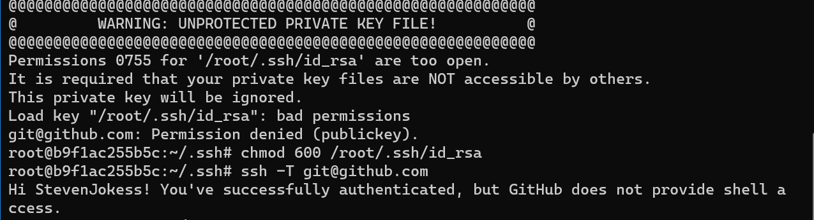

# D2L-Book2: A Toolkit for Hands-on Books

This package helps you build and publish **a book with Python code**, or
**Python package documents with tutorials**. The document site is available at
docs/

TODO: https://github.com/d2l-ai/d2l-book/commit/5f078f8812bb0f2bf45d9648fa80e1ba63f7b524
https://github.com/d2l-ai/d2l-book/commit/5f078f8812bb0f2bf45d9648fa80e1ba63f7b524


Install:

```bash
pip install git+https://github.com/aieye-top/d2l-book2/
```

https://book.d2l.ai/user/deploy.html


## To deploy to Github

The only difference is

```bash
d2lbook2 deploy html
```

instead of `d2lbook deploy html`

 For this example, the URL is https://github.com/aieye-top/d2cl

The result:
https://aieye-top.github.io/d2cl/

## Docker

 https://github.com/ykxVK8yL5L/6pan/blob/main/.github/workflows/docker-image.yml
 https://www.youtube.com/watch?v=fSKbUgRL3vA

### Not China:

```bash
docker pull stevenjokes/d2l-book2:latest
```

```bash
docker run stevenjokes/d2l-book2:latest build html
```

---

### 国内：

```bash
docker pull registry.cn-shanghai.aliyuncs.com/csq-dl/d2l-book2:latest
```

![pull]](img/docker_pull.png)


#### 用例：

(base) PS C:\Users\a8679> docker run registry.cn-shanghai.aliyuncs.com/csq-dl/d2l-book2:latest
usage: d2lbook2 [-h] {build,deploy,clear,activate,translate}

D2L Book: Publish a book based on Jupyter notebooks. Run d2lbook2 command -h
to get the help message for each command.

positional arguments:
  {build,deploy,clear,activate,translate}

optional arguments:
  -h, --help            show this help message and exit


```bash
docker run --rm --name d2cl-whole -ditv /d/onedrive/Documents/read/d2cl-whole:/d2lbook2/ registry.cn-shanghai.aliyuncs.com/csq-dl/d2l-book2:latest  /bin/bash
```

* --rm: 在容器终止运行后自动删除容器文件
* --name: 给他指定了一个d2cl-whole名
* -d: 后台运行容器，并返回容器ID；
* -i: 以交互模式运行容器，通常与 -t 同时使用；
* -t: 为容器重新分配一个伪输入终端，通常与 -i 同时使用；
* -v: 把Win10宿主机的/d/onedrive/Documents/read/d2cl-whole/下载目录挂载到registry.cn-shanghai.aliyuncs.com/csq-dl/d2l-book2:latest容器的/d2lbook2目录下。


```bash
docker cp "D:/onedrive/Documents/read/d2cl-whole" d2cl-whole:/d2lbook2/d2cl-whole
docker exec -it d2cl-whole /bin/bash
```


还是没搞懂，试了下挂载-v为啥只有目录没有文件？求大佬解答，只能cp下维持下生活。。

```bash
ls
```

应该能看到d2cl-whole

```bash
cd d2cl-whole/d2cl
d2lbook2 build html;d2lbook2 deploy html
```


### deploy to github

此时还没连上GitHub
不信可以
ssh -T git@github.com

在deploy之前给ssh


```bash
docker cp "C:\Users\a8679\.ssh" d2cl-whole:/root/.ssh
```




```bash
d2lbook2 deploy html
```

要登录用户名密钥，缓存

```bash
git config --global credential.helper cache
```
